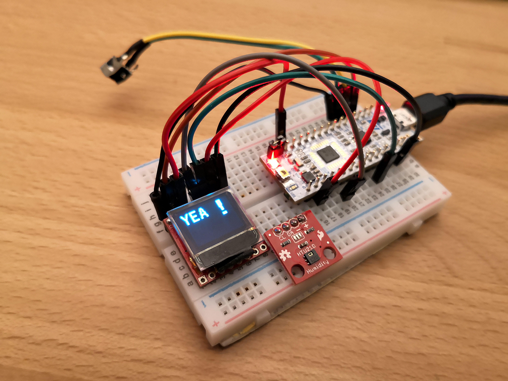

# stm32-ssd1306

STM32 library for working with OLEDs based on SSD1306, SH1106 and SSD1309,
supports I2C and 4-wire SPI.

Tested on STM32F1, STM32F4 and STM32L4 MCUs, with 10 random displays from eBay. 
STM32L4 is only tested with SPI on a Sparkfun micro OLED with SSD1306. 
Also this
code is known to work with
[afiskon/fpga-ssd1306-to-vga](https://github.com/afiskon/fpga-ssd1306-to-vga).

Please see `examples` directory and `ssd1306/ssd1306.h` for more details.

The code is based on
[4ilo/ssd1306-stm32HAL](https://github.com/4ilo/ssd1306-stm32HAL) library
developed by Olivier Van den Eede ( [@4ilo](https://github.com/4ilo) ) in 2016.

See also:

* https://github.com/afiskon/stm32-ssd1351
* https://github.com/afiskon/stm32-st7735
* https://github.com/afiskon/stm32-ili9341

