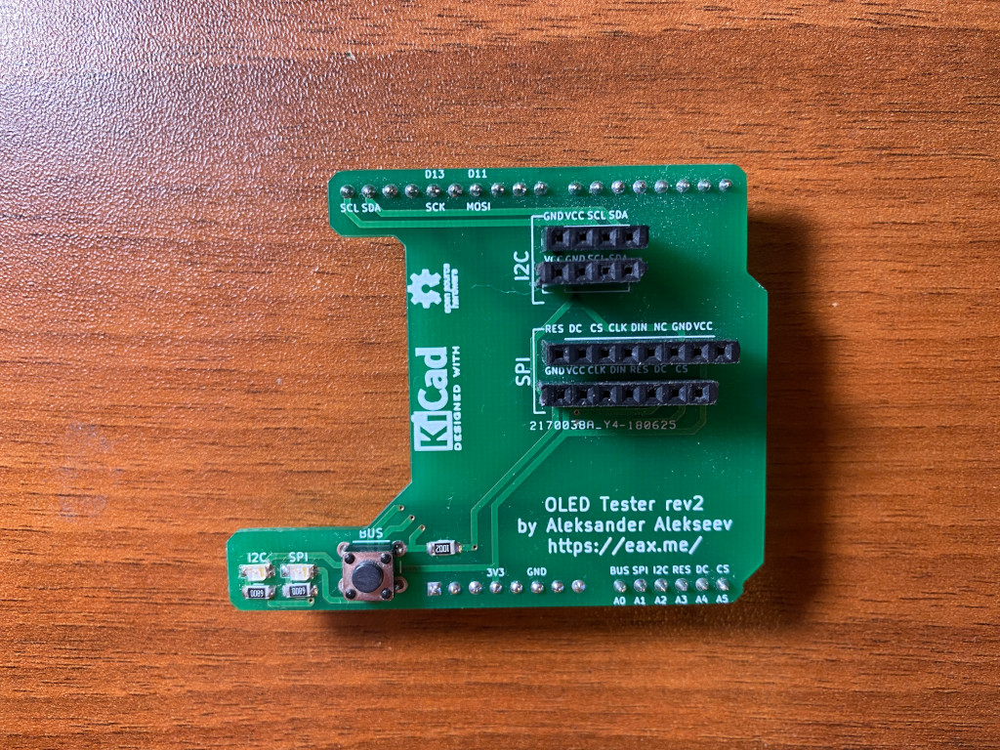
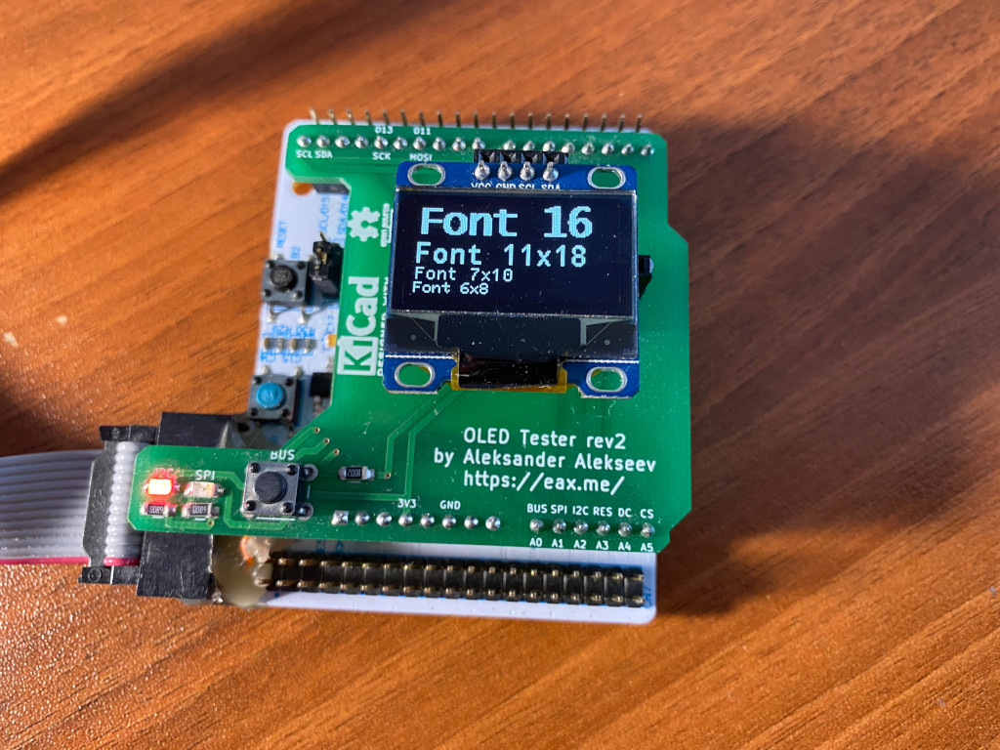

# oled-tester

This is an OLED tester based on Nucleo-F411RE development board.

The project contains gerber files of an Arduino shield (see `hardware` directory)
and two versions of a firmware - I2C and SPI one. Given display can be tested by
plugging it into the shield and pressing a blue button on the Nucleo board.

The shield:

The tester:

