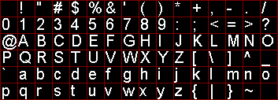

# Creating Custom Fonts

This directory contains an example of creating custom fonts with Python.

Here we are creating Font_16x24. This is an upscaled HD44780 5x8 font.
Its main purpose is to simulate 0802 character LCDs.

The source font is stored in hd44780-small.txt which is upscaled using
upscale.py:

```bash
./upscale.py -f ./hd44780-small.txt -x 5 -y 8 -s 3 > hd44780-large.txt
```

The C code is created from hd44780-large.txt using convert.py:

```bash
./convert.py -f ./hd44780-large.txt -x 16 -y 24
```

Font encoding is pretty straightforward. Let's consider Font_6x8 as the smallest
one:

```c
SSD1306_Font_t Font_6x8 = {6, 8, Font6x8, NULL};

// ...

static const uint16_t Font6x8 [] = {
0x0000, 0x0000, 0x0000, 0x0000, 0x0000, 0x0000, 0x0000, 0x0000,  // sp
0x2000, 0x2000, 0x2000, 0x2000, 0x2000, 0x0000, 0x2000, 0x0000,  // !
// ... etc ...
```

First 8 values in the array (where 8 is the height of the given font) encode
the first symbol one line after another. Next 8 values encode the second symbol,
etc. Each bit encodes one pixel. Since values are of type uint16_t, the font
width is limited to 16 pixels.

For instance, the exclamation mark is encoded as:

```c
0x2000, 0x2000, 0x2000, 0x2000, 0x2000, 0x0000, 0x2000, 0x0000,  // !

```

... or:

```c
0x2000 // line 1
0x2000 // line 2
0x2000 // line 3
0x2000 // line 4
0x2000 // line 5
0x0000 // line 6
0x2000 // line 7
0x0000 // line 8
```

... which in binary form is:

```c
001000
001000
001000
001000
001000
000000
001000
000000
```

If we remove zeroes:

```c
  1
  1
  1
  1
  1

  1

```

... a 6x8 pixels exclamation mark can clearly be seen. The rest of the symbols
are encoded in the same way.

Knowing this you can create any custom fonts and also modify convert.py
if necessary.

## Font generator

You can create custom font from TrueType via `generate.py`

```bash
./generate.py --font arial.ttf --size 20
```

It generates `font.c` with the required font ready-to-use

**Note:** actual height of generated bitmap may be different

To generate proportional (non-monospaced) font, add `--proportional` flag

```bash
./generate.py --font Roboto-Thin.ttf --size 15 --proportional 
```

You can check preview of generated font in font atlas

```bash
./generate.py --font arial.ttf --size 20 --atlas atlas.png
```



Or you may prefer use a pre-rendered bitmap of a string. This may be useful to generate non-ASCII characters

```bash
./generate.py --font arial.ttf --size 21 --string "Привет Мир!"
```

Generated `string.c`:

```c
/** "Привет Мир!" bitmap 120x19 */
const unsigned char string_120x19[] = {
    0x7F, 0xF8, 0x00, 0x00, 0x00, 0x00, 0x00, 0x00, 0x00, 0x0E, 0x00, 0xE0,
  ...
```


